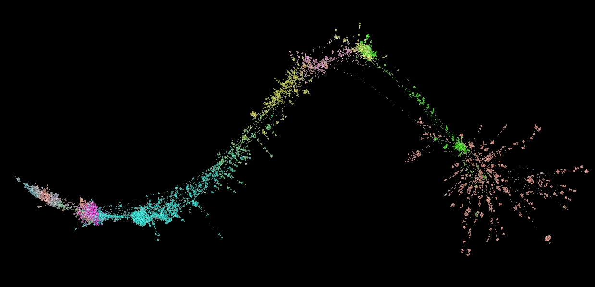

# Social network analysis data for the study of Chinese Buddhist history

The datasets provided here combine the data of various [Gaoseng zhuan 高僧傳](http://buddhistinformatics.dila.edu.tw/biographies/gis/) projects with the [Buddhist Person Name Authority](http://authority.dila.edu.tw/person/). The original data points were originally collected at the [Dharma Drum Institute of Liberal Arts](http://www.dila.edu.tw) with help from the [Chung-hwa Institute of Buddhist Studies](http://www.chibs.edu.tw/) and are available from there.

The evolving datasets offered here are prepared in formats that allow immediate use in open source SNA tools (such as [Gephi](https://gephi.org)) and are the basis for an ongoing series of presentations, workshops and papers. If you find any errors in the data, or would like to create or contribute data on social networks related to the study of Buddhist history, please get in touch.

## Currently available
Chinese Buddhist - Historical Social Network Dataset version 2019-11. (c.16,700 nodes (actors), and c.24,000 edges (connections)):
* As .gephi project file [c.1.1MB] (Layouted with ForceAtlas2 (Scale:0.5, Gravity: 0.3, Edge Weight 0.0, Theta: 1.6), Colored by dynasty)).
* As .gexf file [c.19 MB] (DIY layout).

 
[Marcus Bingenheimer](https://mbingenheimer.net/publications/publications.html)

July 2016 - now

 The "CB HSNA dataset" is licensed under a <a rel="license" href="http://creativecommons.org/licenses/by-nc-sa/4.0/">Creative Commons Attribution-NonCommercial-ShareAlike 4.0 International License</a>.

