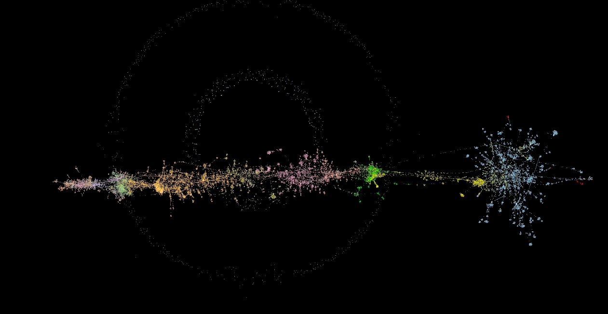

# Historical Social Network of Chinese Buddhism

This repository provides social network data for the study of Chinese Buddhist history. The datasets combine the raw data of various [Gaoseng zhuan 高僧傳](http://buddhistinformatics.dila.edu.tw/biographies/gis/) projects with the [Buddhist Person Name Authority](http://authority.dila.edu.tw/person/). The original data was collected at the [Dharma Drum Institute of Liberal Arts](http://www.dila.edu.tw) in collaboration with the [Chung-hwa Institute of Buddhist Studies](http://www.chibs.edu.tw/) and is still available there.

The evolving datasets offered here are prepared for immediate use in open source SNA tools (such as [Gephi](https://gephi.org) or [Cytoscape](https://cytoscape.org/)) and are the basis for an ongoing series of presentations, workshops and papers. If you find any errors in the data, or would like to create or contribute data on social networks related to the study of Buddhist history, please get in touch.

Further supporting material can be found [here](https://mbingenheimer.net/tools/socnet/).

## Currently available datasets
Historical Social Network of Chinese Buddhism version 2020-07. (c.17,450 nodes (actors), and c.31,900 edges (connections)):
* As .gephi project file [c.1.2MB] (Layouted with ForceAtlas2 (Scale:0.5, Gravity: 0.2, Edge Weight 0.0, Theta: 1.7) & Yifan Hu)).
* As .gexf file [c.19 MB] (DIY layout, colored for dynasty).

Unsure what to do with this? Try this [how-to](https://mbingenheimer.net/tools/socnet/how-to.html).

## Citation
If you are using this dataset please cite:

     Marcus Bingenheimer. 2020. ‘Historical Social Network of Chinese Buddhism’ Ver.2020-07. https://github.com/mbingenheimer/ChineseBuddhism_SNA.

## Articles
For those interested in the structure of the Gaoseng zhuan data, and more information on how to use the dataset:

* Marcus BINGENHEIMER. 2018. [“Who was ‘Central’ for Chinese Buddhist History? - A Social Network Approach.”](https://mbingenheimer.net/publications/bingenheimer.2018.whoWasCentral.pdf) _International Journal of Buddhist Thought and Culture_. Vol.28-2 (Dec. 2018): 45-67.

* Marcus BINGENHEIMER, Jen-Jou HUNG, Simon WILES. 2011. ["Social Network Visualization from TEI Data."](http://llc.oxfordjournals.org/content/26/3/271.full?keytype=ref&ijkey=wLyXwiS5HkR3XR3) _Literary and Linguistic Computing_ 26(3), 2011, pp. 271-278.

 
[Marcus Bingenheimer](https://mbingenheimer.net/publications/publications.html)

July 2016 - now

 This work is licensed under a <a rel="license" href="http://creativecommons.org/licenses/by-sa/4.0/">Creative Commons Attribution-ShareAlike 4.0 International License</a>.

